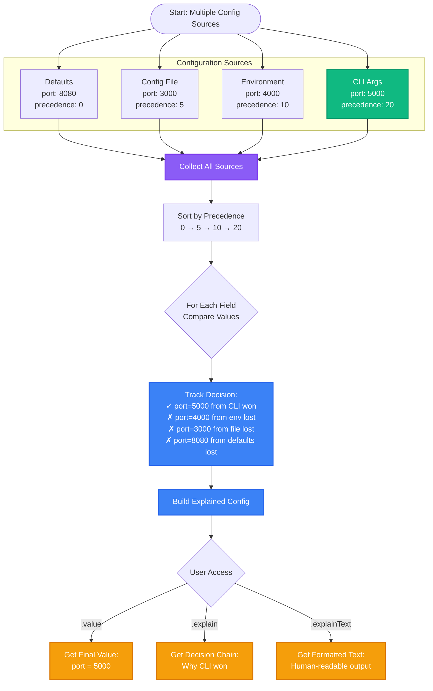
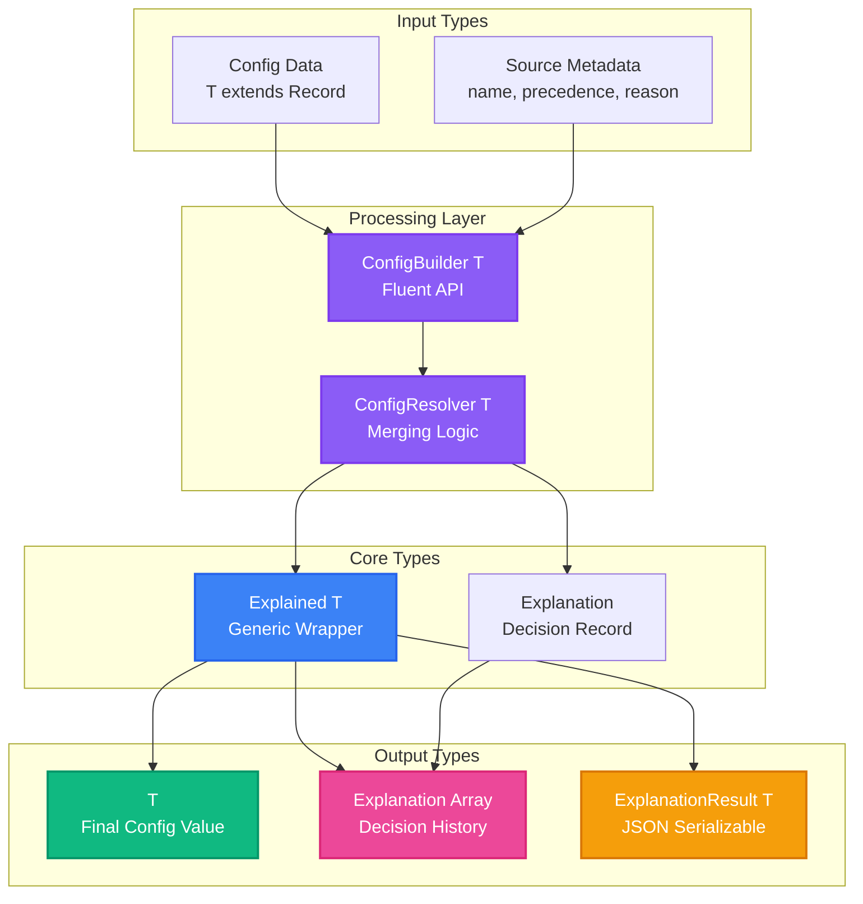
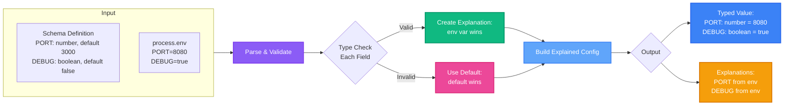
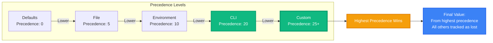
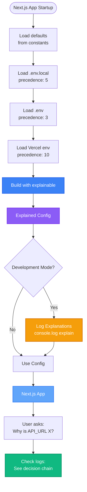
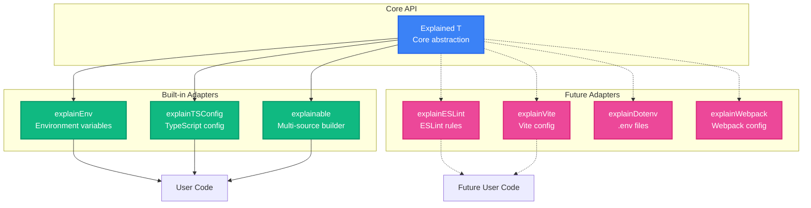

# Explainable - Visual Diagrams

This document contains visual diagrams to help understand how `explainable` works.

## Decision Resolution Flow

<div align="center">
  
</div>

<details>
<summary>View Mermaid Source Code</summary>



</details>

---

## Type System & Data Flow

<div align="center">
  
</div>

<details>
<summary>View Mermaid Source Code</summary>



</details>

---

## Environment Adapter Flow

<div align="center">
  
</div>

<details>
<summary>View Mermaid Source Code</summary>



</details>

---

## Precedence Resolution

<div align="center">
  
</div>

<details>
<summary>View Mermaid Source Code</summary>



</details>

---

## Use Case: Next.js Configuration

<div align="center">
  
</div>

<details>
<summary>View Mermaid Source Code</summary>



</details>

---

## Adapter Pattern for Ecosystem

<div align="center">
  
</div>

<details>
<summary>View Mermaid Source Code</summary>



</details>

---

## Legend - Color Scheme

- 🔵 **Blue (#3B82F6)**: Core components (Explained, processing, config objects)
- 🟢 **Green (#10B981)**: Successful/winning values, built-in features, highest precedence
- 🟠 **Orange (#F59E0B)**: Output, results, explanations, final values
- 🟣 **Purple (#8B5CF6)**: Resolvers, processing engines, transformations
- 🌸 **Pink (#EC4899)**: Adapters, future features, fallbacks
- 🔷 **Light Blue (#60A5FA)**: Secondary components, helpers
- ➡️ **Solid lines**: Implemented functionality
- ⋯➡️ **Dashed lines**: Future/planned features

## How to Read These Diagrams

1. **Flow Direction**: Follow arrows from left to right or top to bottom
2. **Colors**: Indicate component type or status (see legend)
3. **Precedence**: Higher numbers win over lower numbers
4. **Shapes**:
   - Rectangles: Processes or components
   - Diamonds: Decision points
   - Rounded rectangles: Start/end points
   - Grouped boxes: Related components

## Understanding Precedence

```
Defaults (0) < File (5) < Environment (10) < CLI (20) < Custom (25+)

When the same field appears in multiple sources:
- The source with HIGHER precedence wins
- All other sources are tracked as "lost"
- You can see the complete decision chain
```

## Real-World Example

```
Your port is 5000 because:
✓ CLI argument provided it (precedence: 20) ← WINNER
✗ Environment variable had 4000 (precedence: 10)
✗ Config file had 3000 (precedence: 5)
✗ Default was 8080 (precedence: 0)

Without explainable: You see 5000, no idea why
With explainable: You see exactly why and what was overridden
```

